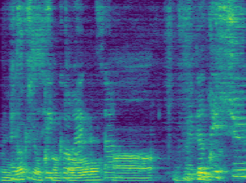

Download Model CKPT Files in "base" folder from : https://drive.usercontent.google.com/download?id=1EXPBSXwTaqrSC0OhUdXNmKSh9qJUQ55-&export=download&authuser=0&confirm=t&uuid=c3a267f8-4aa0-47ac-b626-401ab8d2a537&at=AO7h07esAHb_XgHh_r1uM5p0CTCi%3A1725968104713

Download avspeech-dataset in "Looking-to-Listen-at-the-Cocktail-Party-master/data/csv/" from https://looking-to-listen.github.io/avspeech/download.html

# Setup
```
pip install -r requirements.txt
```

```
brew install ffmpeg
brew install sox
```
Also works with pip install

Install yt-dlp to download Video Data
```
pip install yt-dlp
```
## Preprocessing
### Video Data
Download the dataset from here and place files in data/csv.
First use this command to download the YouTube video and use ffmpeg to capture the 3 second video as 75 images.
```
python3 video_download.py
```
Then use mtcnn to get the image bounding box of the face, and then use the CSV x, y to locate the face center point.
```
pip install mtcnn
python3 face_detect.py
python3 check_valid_face.py
```
### Audio Data
For the audio section, use the YouTube download tool to download the audio, then set the sample rate to 16000 via the librosa library. Finally, the audio data is normalized.
```
python3 audio_downloads.py
python3 audio_norm.py # audio_data normalized
```
Pre-processing audio data, including stft, Power-law, blending, generating complex masks, etc....
```
python3 audio_data.py
```
### Face embedding Feature
Here we use Google's FaceNet method to map face images to high-dimensional Euclidean space. In this project, we use David Sandberg's open source FaceNet preprocessing model "20180402-114759". Then use the TensorFlow_to_Keras script in this project to convert.（Model/face_embedding/）
Schroff F, Kalenichenko D, Philbin J. Facenet: A unified embedding for face recognition and clustering[C]//Proceedings of the IEEE conference on computer vision and pattern recognition. 2015: 815-823.

```
python3 Tensorflow_to_Keras.py
python3 face_emb.py
```
#### Create AVdataset_train.txt and AVdataset_val.txt
```
python3 AV_data_log.py
```
## Training

According to the description in the paper, set the following parameters:
```
people_num = 2 # How many people you want to separate?
epochs = 100
initial_epoch = 0
batch_size = 1 # 2,4 need to GPU
gamma_loss = 0.1
beta_loss = gamma_loss * 2
```
Then use the script train.py to train

## Results


Accuracy over 100 Epochs - Training and Validation datasets


Test Outputs includes WAV files for each speakers (currently testing for 2 speakers)

#### For 2 Speakers
BenchMark Results:
| sdr             | 1.696760 |
|-----------------|-----------|
| sdr_mixed       | 0.105482 |
| sdr - sdr_mixed | 1.591277 |
| sir             | 4.243004 |
| sar             | 8.943523  |

SDR has increased, but our main focus is to improve SDR Mixed, which observed no change.

Link to OUTPUT WAV Files: https://drive.google.com/drive/folders/1XXSSuKvuB05YT3WlvuKpJNAFAqwMOfSP?usp=drive_link

###### Spectrogram Images


Audio1 Original Spectrogram


Audio2 Original Spectrogram


Audio Mix Spectrogram



Audio1 Separation Spectrogram


Audio2 Separation Spectrogram